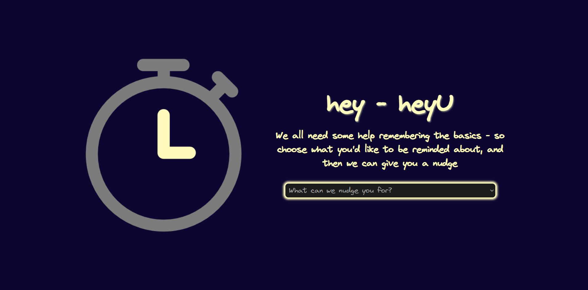
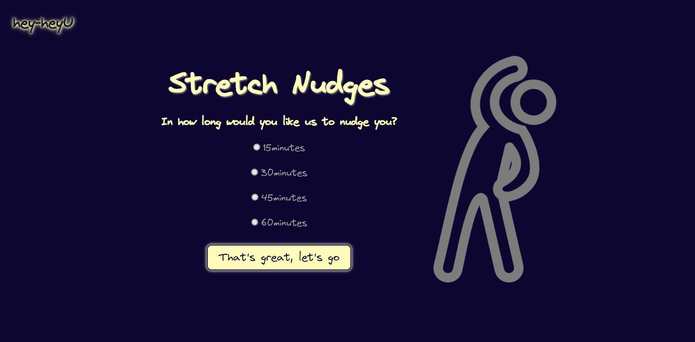
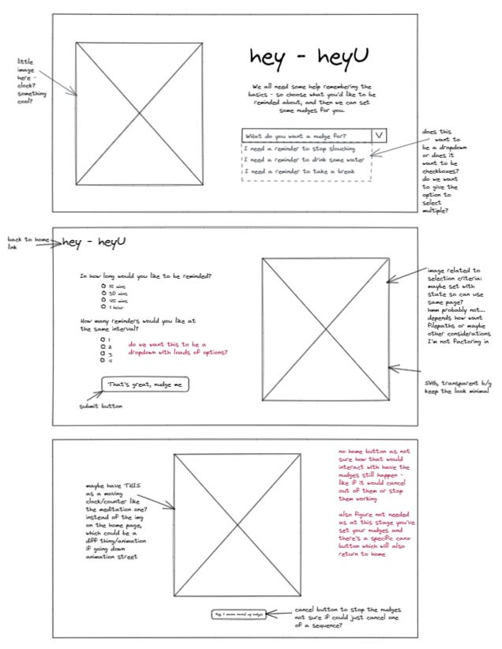
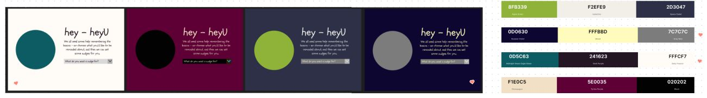
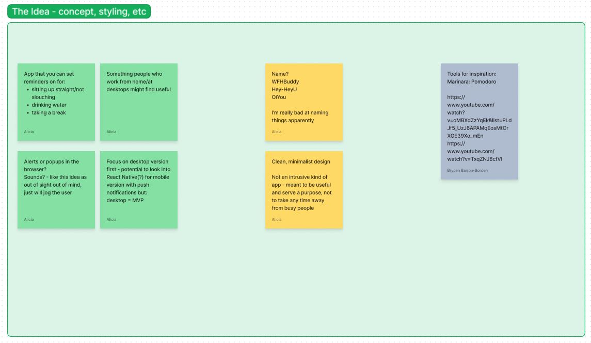
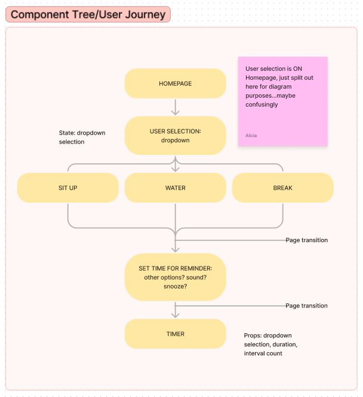

# hey-heyU

[Visit the app DESKTOP ONLY](https://hey-heyu.netlify.app/)

 

## The Project

This project was inspired by a friend who complained to me that they needed someone to tell them to sit up during the day, as they have terrible posture and suffer with backache because of it. Initially, [Brycen Barron-Borden](https://github.com/brycenbb) was meant to collaborate, but sadly for me - and happily for him - he got a job and abandoned me for money and the real world. Still, if it wasn't for Brycen suggesting we work together this app probably wouldn't have happened, because I started it mainly from sheer disbelief that he found me worthy 😂

hey-heyu is a React app designed for users who work from home and/or spend a lot of time in front of their computer. The app will notify - or nudge - the user after a chosen time period to remind them to do things like check their posture or take a break.

## Ideation

The app was planned and designed using Excalidraw and Figma/Figjam, where I created wireframes and mapped out the idea and user journey.

Initially Brycen and I created a Trello board for project management, but as this turned into a solo project I didn't require this. It did, however, give good structure to starting out with the project, and has we worked together it would have had clear benefits as it allowed for us to add and track things asynchronously.

## The Build

The MVP for the app was to build a desktop version of the app, foussing on being able to notify a user on a desktop browser. I investigated methods of doing this as I had no prior knowledge and wasn't sure whether or not a library would be required, but during my research I discovered the [Notifications API](https://developer.mozilla.org/en-US/docs/Web/API/Notifications_API).

I discovered a lot of things during to build process that I hadn't been previously aware of - from the initial stumbling block of how to navigate from a select option in a dropdown (because <a> tags can't be used, which also rendered React Link unusable), to the more problematic issue of setInterval being throttled in an inactive tab.

The app is meant to be a quick thing to use, and in effect a set-and-forget, so being able to provide timely notifications when the user was focussed elsewhere was essential.

In the end I resolved this by using Date.now() and getTime() in conjunction with a setTimeout controlled by state. The countdown display, however, was still linked to a lagging setInterval, so I implemented some CSS transitions to have the countdown fade out after a few seconds - enough to let the user know what was happening, but not leave an incorrect display onscreen. As the app isn't meant to be something that's watched, I feel like this was actually a nice solution.

## Further Resources

[How to build a Pomodoro Timer in React](https://www.youtube.com/watch?v=9z1qBcFwdXg&t=577s)

[Clear a timeout or an interval in React with hooks](https://bobbyhadz.com/blog/react-cleartimeout) - essential for clearing the setInterval on the countdown display

## Tech

React, React Router, JavaScript, HTML, CSS, Notifications API, Netlify

## Feedback and Future Implementation

I'm currently awaiting some user feedback, having just deployed the app.

For future iterations, I'd like to look at moile notifications and making this functional on mobile - though I would be interested if users think this would be useful or not, given it's designed for people working on a computer. I also plan on adding a light mode.
